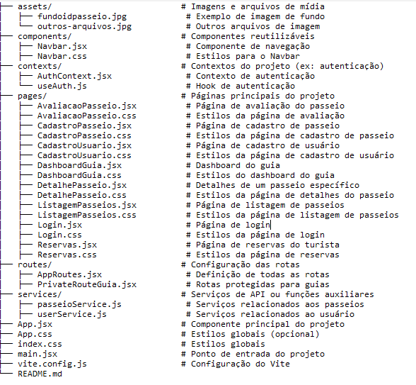

# Brazil365

O Brazil365 é uma plataforma inovadora que conecta viajantes a guias turísticos locais, proporcionando experiências personalizadas e autênticas. 

Com o objetivo de facilitar a exploração de destinos sob a perspectiva de especialistas regionais, a aplicação permite que usuários se cadastrem como guias ou turistas, naveguem por passeios exclusivos, realizem reservas e avaliem suas experiências de maneira intuitiva e eficiente."

## Tecnologias utilizadas

## Funcionalidades e Telas 

## 1. Login e Autenticação: (/login)
Permite que os usuários façam login com e-mail e senha. 

### 2. Cadastro de Usuários: (/cadastro)
O usuários poderão de cadastrar como turista ou como guia.

### 3. Dashboard do Guia: (/dashboard-guia)
* Quantidade de passeios cadastrados e atalhos para as páginas de cadastro e listagem de passeios.
* Apenas usuários autenticados com perfil de guia podem acessar essa página.

### 4. Cadastro de Novo Passeio: (/passeio/novo)

* Cadastro de novos passeios feitos pelos guias.
* Cada passeio deve ter um nome único para o guia que o cadastrou.
* O guia deve preencher todos os campos obrigatórios para cadastrar um passeio.
* O número de passeios cadastrados pelo guia será controlado localmente, sem limite pré-definido.

### 5. Listagem de Passeios: (/passeios)

* Apenas usuários autenticados podem ter acesso a lista de passeios.
* Os turistas podem realizar a reserva de um passeio diretamente a partir desta página.

### 6. Detalhe de Passeio: (/passeio/:id)

* Apenas o guia que cadastrou o passeio pode editá-lo ou excluí-lo.
* Os turistas podem visualizar os detalhes e reservar o passeio.

### 7. Reservas (Turista) (/reservas):

* Apenas turistas autenticados possuem acesso as suas reservas,e podem cancelar
diretamente por esta página.

### 8. Avaliações de Passeio (/avaliacoes/:id):

### Estrutura do Projeto - Brazil365

### Plano de Projeto

Ao construir a aplicação coloquei em prática os aprendizados em:

* **Versionamento:** Uso do GitHub para versionamento de código.
* **HTML:** Tags e Elementos semânticos
* **CSS:** Seletores, Principais estilos, Layouts e Flexbox
* **JavaScript**: Variáveis, Tipos de dados, Operadores, Manipulação do DOM, Estrutura de Controle de Fluxo, Funções, Eventos, JSON, LocalStorage, Interval, Timeout, Operadores Rest e Spread, Módulos, Arrow Functions, Funções de Arrays, Funções Assíncronas e Fetch.
* **React:** Renderização de componentes, Props, Proptypes, Hooks, Eventos, Renderização de listas, React Router, Formulários, Prop Drilling, Composition, Estilos Bootstrap, Developer Tools e Deploy.
* **Skills:** Organização, criação de documentação e apresentação de solução.

## Futura Dev

Turma Trip - 2024 Floripa Mais tec

⌨️ com 💜 por Livia Serencovich Carvalho