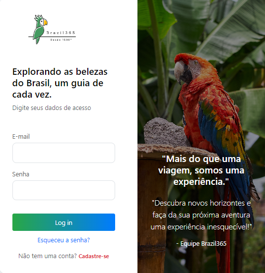

# Brazil365

O Brazil365 é uma plataforma inovadora que conecta viajantes a guias turísticos locais, proporcionando experiências personalizadas e autênticas. 

Com o objetivo de facilitar a exploração de destinos sob a perspectiva de especialistas regionais, a aplicação permite que usuários se cadastrem como guias ou turistas, naveguem por passeios exclusivos, realizem reservas e avaliem suas experiências de maneira intuitiva e eficiente."

## Tecnologias utilizadas

## Funcionalidades e Telas 

## 1. Login e Autenticação: (/login)
Permite que os usuários façam login com e-mail e senha. 

### 2. Cadastro de Usuários: (/cadastro)
O usuários poderão de cadastrar como turista ou como guia.

### 3. Dashboard do Guia: (/dashboard-guia)
* Quantidade de passeios cadastrados e atalhos para as páginas de cadastro e listagem de passeios.
* Apenas usuários autenticados com perfil de guia podem acessar essa página.

### 4. Cadastro de Novo Passeio: (/passeio/novo)

* Cadastro de novos passeios feitos pelos guias.
* Cada passeio deve ter um nome único para o guia que o cadastrou.
* O guia deve preencher todos os campos obrigatórios para cadastrar um passeio.
* O número de passeios cadastrados pelo guia será controlado localmente, sem limite pré-definido.

### 5. Listagem de Passeios: (/passeios)

* Apenas usuários autenticados podem ter acesso a lista de passeios.
* Os turistas podem realizar a reserva de um passeio diretamente a partir desta página.

### 6. Detalhe de Passeio: (/passeio/:id)

* Apenas o guia que cadastrou o passeio pode editá-lo ou excluí-lo.
* Os turistas podem visualizar os detalhes e reservar o passeio.

### 7. Reservas (Turista) (/reservas):

* Apenas turistas autenticados possuem acesso as suas reservas,e podem cancelar
diretamente por esta página.

### 8. Avaliações de Passeio (/avaliacoes/:id):

### Estrutura do Projeto - Brazil365

├── assets/                          # Imagens e arquivos de mídia
│   ├── fundoidpasseio.jpg            # Exemplo de imagem de fundo
│   └── outros-arquivos.jpg           # Outros arquivos de imagem
├── components/                      # Componentes reutilizáveis
│   ├── Navbar.jsx                    # Componente de navegação
│   ├── Navbar.css                    # Estilos para o Navbar
├── contexts/                        # Contextos do projeto (ex: autenticação)
│   ├── AuthContext.jsx               # Contexto de autenticação
│   └── useAuth.js                    # Hook de autenticação
├── pages/                           # Páginas principais do projeto
│   ├── AvaliacaoPasseio.jsx          # Página de avaliação do passeio
│   ├── AvaliacaoPasseio.css          # Estilos da página de avaliação
│   ├── CadastroPasseio.jsx           # Página de cadastro de passeio
│   ├── CadastroPasseio.css           # Estilos da página de cadastro de passeio
│   ├── CadastroUsuario.jsx           # Página de cadastro de usuário
│   ├── CadastroUsuario.css           # Estilos da página de cadastro de usuário
│   ├── DashboardGuia.jsx             # Dashboard do guia
│   ├── DashboardGuia.css             # Estilos do dashboard do guia
│   ├── DetalhePasseio.jsx            # Detalhes de um passeio específico
│   ├── DetalhePasseio.css            # Estilos da página de detalhes do passeio
│   ├── ListagemPasseios.jsx          # Página de listagem de passeios
│   ├── ListagemPasseios.css          # Estilos da página de listagem de passeios
│   ├── Login.jsx                     # Página de login
│   ├── Login.css                     # Estilos da página de login
│   ├── Reservas.jsx                  # Página de reservas do turista
│   ├── Reservas.css                  # Estilos da página de reservas
├── routes/                          # Configuração das rotas
│   ├── AppRoutes.jsx                 # Definição de todas as rotas
│   ├── PrivateRouteGuia.jsx          # Rotas protegidas para guias
├── services/                        # Serviços de API ou funções auxiliares
│   ├── passeioService.js             # Serviços relacionados aos passeios
│   ├── userService.js                # Serviços relacionados ao usuário
├── App.jsx                          # Componente principal do projeto
├── App.css                          # Estilos globais (opcional)
├── index.css                        # Estilos globais
├── main.jsx                         # Ponto de entrada do projeto
├── vite.config.js                   # Configuração do Vite
└── README.md                        # Documentação do projeto

### Plano de Projeto

Ao construir a aplicação coloquei em prática os aprendizados em:

* **Versionamento:** Uso do GitHub para versionamento de código.
* **HTML:** Tags e Elementos semânticos
* **CSS:** Seletores, Principais estilos, Layouts e Flexbox
* **JavaScript**: Variáveis, Tipos de dados, Operadores, Manipulação do DOM, Estrutura de Controle de Fluxo, Funções, Eventos, JSON, LocalStorage, Interval, Timeout, Operadores Rest e Spread, Módulos, Arrow Functions, Funções de Arrays, Funções Assíncronas e Fetch.
* **React:** Renderização de componentes, Props, Proptypes, Hooks, Eventos, Renderização de listas, React Router, Formulários, Prop Drilling, Composition, Estilos Bootstrap, Developer Tools e Deploy.
* **Skills:** Organização, criação de documentação e apresentação de solução.
